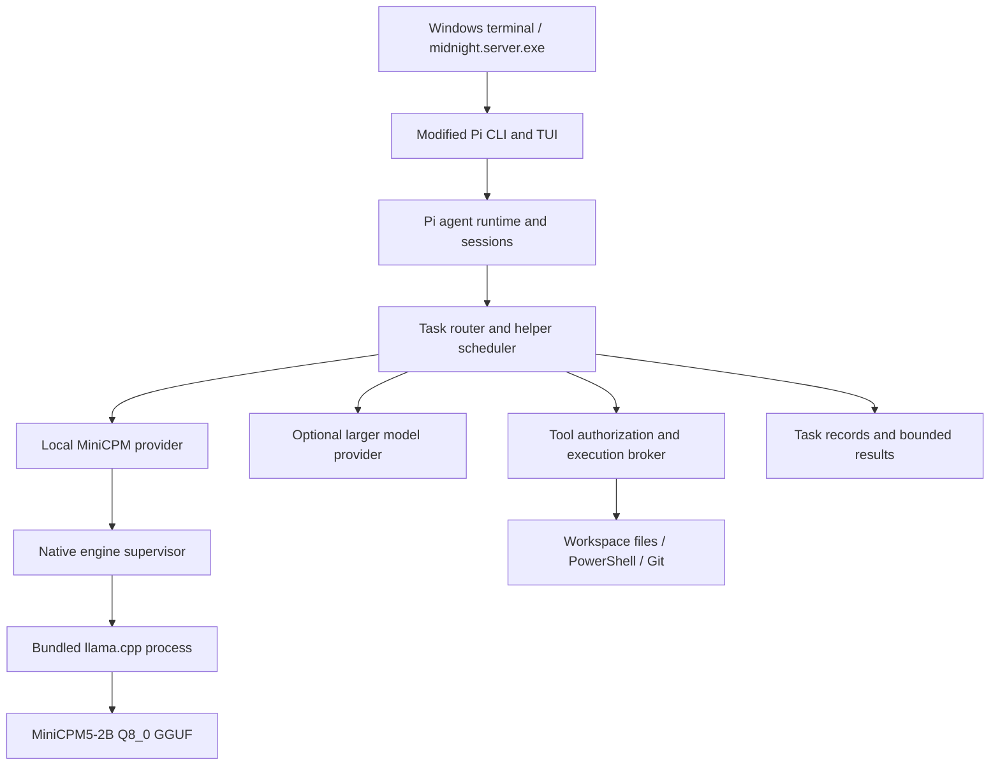

# midnight.server: implementation plan

Research date: 2026-09-25. Target repository: `soliluqoy/midnight.server` (public).

This is an implementation specification, not a claim that the application or its performance has been validated. Source and model metadata were inspected; no inference benchmark or compiled application was produced during planning. Commands and new file paths below describe future implementation unless explicitly identified as existing upstream files.

## 1. Product definition and decisions

Build `midnight.server.exe`, a native Windows coding CLI and terminal UI, from a maintained source derivative of the user's Pi fork. Integrate MiniCPM5-2B Q8_0 as a local helper that can receive bounded tasks, propose task decomposition, and perform small coding jobs. Retain Pi's larger-model provider support for work beyond the helper's capabilities.

The Linux distribution analogy applies to source ownership, integration, and coordinated releases: Pi supplies the agent foundation; midnight.server owns its behavior, inference integration, packaging, defaults, and update lifecycle. Pi is a TypeScript application foundation, rather than an operating-system kernel.

| Decision | Planned choice | Rationale |
| --- | --- | --- |
| Source foundation | Modify `soliluqoy/pi` source directly | Meets the requirement for a source derivative rather than an extension-only wrapper |
| Embedded model | Official final/post-trained MiniCPM5-2B, GGUF Q8_0 | Retains the requested model and quantization |
| Native inference | Vendored llama.cpp, CPU baseline plus optional GPU builds | Windows build support and an official MiniCPM GGUF deployment path |
| Engine integration | App-managed native child process initially | A single installation with no separately installed inference service; easier crash isolation |
| CLI executable | Pi's existing Bun compilation approach | Reuses an upstream Windows packaging route |
| Shell | PowerShell by default on Windows | Reuse Pi's existing optional PowerShell tool and finish remaining Bash assumptions |
| Source organization | One Git repository and coordinated build | No mandatory submodules or independent product repositories |
| Model distribution | Versioned external artifact, included in full offline bundle | Keep multi-gigabyte weights out of ordinary Git history |
| SGLang | Optional measured GPU backend, not default Windows dependency | Source supports Q8_0, but speed superiority and native standalone suitability are unproven |

The engine choice follows deployment evidence: [MiniCPM's llama.cpp guide](https://github.com/OpenBMB/MiniCPM/blob/main/docs/deployment/llama_cpp.md) describes Python-free Windows GGUF use; [llama.cpp build documentation](https://github.com/ggml-org/llama.cpp/blob/master/docs/build.md) covers native backends. This recommendation is an engineering judgment about this product's constraints, not a benchmark result.

### Meaning of standalone and embedded

The release must launch on a supported clean Windows machine without separately installed Node.js, Bun, Python, PyTorch, Ollama, LM Studio, Docker, or WSL. Operating-system components and a compatible GPU driver remain prerequisites. Git and project-specific compilers are capabilities for working on repositories, not prerequisites for local model inference.

One build repository does not require one executable containing every byte. The default full distribution contains the CLI, its native dependencies, the engine, and the model. The CLI owns engine startup and shutdown. This is an embedded product component operating in another process.

If a single downloadable file is desired, ship a self-extracting offline installer hosted where its size is supported. It extracts the engine and GGUF locally. A literal single-process engine or never-extracting executable is a separate engineering milestone; Bun compilation alone does not statically link llama.cpp or make a multi-gigabyte GGUF suitable for in-memory embedding.

## 2. Research findings and source baselines

### 2.1 Pi is already more capable than a minimal four-package skeleton

The user's fork identifies `earendil-works/pi` as its parent. Its coding-agent package currently reports version `0.85.1`, package scope `@earendil-works`, and Node development minimum `22.19.0`. Its root build traverses chord, TUI, telemetry, AI, durable state, agent, SQLite session backend, protocol, client, server, and coding-agent packages. Preserve the actual dependency graph before attempting size reductions. [Inspected root manifest](https://github.com/soliluqoy/pi/blob/36b60d2e8985899743c4cf5bd5f8929832a3f05d/package.json), [coding-agent manifest](https://github.com/soliluqoy/pi/blob/36b60d2e8985899743c4cf5bd5f8929832a3f05d/packages/coding-agent/package.json).

The existing release script targets Windows x64 and ARM64 through Bun, supplies worker entrypoints explicitly, and copies assets and architecture-specific native helpers beside the executable. Reuse that design before pruning dependencies. Its Bash build script should be replaced or wrapped by an equivalent Windows build orchestrator. [Binary build script](https://github.com/soliluqoy/pi/blob/36b60d2e8985899743c4cf5bd5f8929832a3f05d/scripts/build-binaries.sh).

Pi's Windows default remains Bash, but an optional PowerShell tool already exists. Interactive `!` and `!!` commands still use Bash according to the current Windows guide. That gap must be addressed for a native Windows experience. [Windows guide](https://github.com/soliluqoy/pi/blob/36b60d2e8985899743c4cf5bd5f8929832a3f05d/packages/coding-agent/docs/windows.md).

### 2.2 Model identity and exact Q8 artifact

Use `openbmb/MiniCPM5-2B`, the final post-trained release, as the model identity. The separately named `MiniCPM5-2B-Base` is a pretraining checkpoint and is not the intended coding assistant. Here, “Q8 as model base” means the application's default quantized assistant checkpoint. The official card distinguishes these releases. [Model card](https://huggingface.co/openbmb/MiniCPM5-2B).

| Field | Observed value |
| --- | --- |
| GGUF repository | `openbmb/MiniCPM5-2B-GGUF` |
| Revision | `2079a22f3beaa4e306449978533478fe0522f4b3` |
| File | `MiniCPM5-2B-Q8_0.gguf` |
| Bytes | `2679710688` |
| Approximate size | 2.680 decimal GB / 2.496 GiB |
| Published LFS SHA-256 | `c5415f8989bf88a8288f1b55a3cc371af53c07b0faa220a63bd7a990cfaba078` |
| Architecture | `LlamaForCausalLM`, GGUF architecture `llama` |
| Parameters | 2,516,756,480 total |
| Context maximum | 131,072 tokens |

These values come from the [Hugging Face model API](https://huggingface.co/api/models/openbmb/MiniCPM5-2B-GGUF?blobs=true) and [model configuration](https://huggingface.co/openbmb/MiniCPM5-2B/blob/main/config.json). The checksum is published metadata; download and hash the actual file before declaring it verified. Record tokenizer, chat template, EOS IDs, architecture metadata, and license alongside it. GGUF Q8_0 is an eight-bit weight format; it does not imply INT8 activations, FP8, or eight-bit KV cache.

### 2.3 Candidate source pins

| Component | Inspected revision | Status |
| --- | --- | --- |
| `soliluqoy/pi` | `36b60d2e8985899743c4cf5bd5f8929832a3f05d` | Source baseline candidate |
| `soliluqoy/MiniCPM` | `316cfb1cea39f39cfa16b4f5703b77495c2340be` | Model project provenance candidate |
| `ggml-org/llama.cpp` | `cdc06426e70c23a1ac2bce40c85b252fec344702` | Native build candidate, untested |
| `sgl-project/sglang` | `1446e24d13cc28fbea22beb19f68ade24523960d` | Optional benchmark candidate, untested |

These are observed repository heads, not known-good release certifications. Phase 1 must qualify them or replace them with tested immutable revisions. Do not build production artifacts from moving `main`, `master`, or `latest` references.

## 3. SGLang versus llama.cpp

SGLang is a legitimate candidate: its inspected [GGUF implementation](https://github.com/sgl-project/sglang/blob/1446e24d13cc28fbea22beb19f68ade24523960d/python/sglang/srt/layers/quantization/gguf.py) explicitly includes `WeightType.Q8_0`, and its [MiniCPM5 detector](https://github.com/sgl-project/sglang/blob/1446e24d13cc28fbea22beb19f68ade24523960d/python/sglang/srt/function_call/minicpm5_detector.py) exists. Do not dismiss it on the incorrect claim that it cannot support GGUF.

However, this proves code support, not successful loading of this exact artifact, Windows binary portability, or better latency. Its current Python manifest includes a substantial GPU software stack. [SGLang package manifest](https://github.com/sgl-project/sglang/blob/1446e24d13cc28fbea22beb19f68ade24523960d/python/pyproject.toml), [installation documentation](https://docs.sglang.io/docs/get-started/install).

| Requirement | llama.cpp | SGLang |
| --- | --- | --- |
| Native Windows delivery | Documented CMake/native path | No comparable compact native Windows path established by this research |
| CPU fallback | Appropriate baseline | Q8 implementation/backend compatibility needs investigation; unsuitable as assumed CPU fallback |
| Exact Q8_0 GGUF | Official MiniCPM deployment route | Q8_0 present in source; exact loading/tokenizer behavior needs a spike |
| MiniCPM XML tools | Must verify native/generic handler behavior and template round trips | Dedicated MiniCPM5 parser present |
| One interactive helper | Expected suitable fit; measure | Possible GPU benefits; measure end-to-end overhead |
| Many concurrent requests | Supports server concurrency; measure | Prefix caching and serving scheduler make it worth benchmarking |
| Runtime packaging | Native executable/libraries and GGUF | Python, framework packages, GPU kernels, and platform dependencies |
| Product role | Default embedded engine | Optional Linux/WSL2 GPU service profile after qualification |

OpenBMB's SGLang guide recommends tool calling through its MiniCPM parser but contains release advice that refers both to newer package versions and to the parser not yet being in older releases. Treat those passages as stale/inconsistent version guidance. Verify the exact installed release's parser registry and launch flags. [MiniCPM SGLang guide](https://github.com/OpenBMB/MiniCPM/blob/main/docs/deployment/sglang.md), [parser PR](https://github.com/sgl-project/sglang/pull/25600).

### Benchmark decision rule

1. Run llama.cpp CPU and, where hardware permits, CUDA and Vulkan with the pinned Q8_0 file.
2. Run SGLang on a supported Linux/WSL2 NVIDIA environment, first verifying that the same Q8_0 file, tokenizer, and chat template load correctly. Capture any compatibility fixes.
3. Hold prompt corpus, output limits, context sizes, temperature, top-p, and model identity constant. Separate cold start, warm start, prefill, decoding, and total task completion.
4. Test concurrency 1, 2, and 4, and shared-prefix versus unrelated tasks. Include tools, cancellation, invalid output, and memory exhaustion.
5. Report success rate, p50/p95 time to first token, successful-task latency, tokens/sec, RAM/VRAM peak, idle usage, installation size, and setup failures.
6. Proposed adoption threshold for the optional profile: at least 20% improvement in p95 successful-task latency or a demonstrated throughput need, with no material task-quality regression or memory-budget violation. This is a project target, not an observed result.
7. If exact Q8 is unsupported in the tested SGLang configuration, record that failure. A BF16/FP8 comparison may be informative but cannot replace the user's Q8 requirement or be presented as an equal-quantization result.

Even if SGLang wins on a GPU server, retain llama.cpp for the standalone Windows release unless a fully packaged native SGLang build passes the same clean-machine gates. Do not bundle WSL or Docker as an invisible mandatory dependency.

## 4. Architecture



### 4.1 Modes and routing

- **Local:** MiniCPM handles the session and bounded helper jobs offline. Unsupported or failed tasks return explicit limitations.
- **Hybrid:** A user-configured larger model leads complex coding; it delegates suitable work to MiniCPM through a typed `delegate_local` tool.
- **Local coordinator:** MiniCPM proposes a short task plan; deterministic scheduler checks capabilities, budgets, and dependencies before dispatch. A small model never grants itself additional privileges.
- **Explicit assignment:** User invokes a helper task directly, without needing a larger provider.

First helper jobs: repository orientation using supplied search results, test-failure summarization, symbol/file relevance ranking, extracting structured facts, documentation edits, and small patches with clear acceptance checks. Delay large refactors, multi-repository changes, and unconstrained autonomous loops until evaluations justify them.

The router should use deterministic rules before asking a model: local-only requests stay local; oversized tasks are reduced or returned; available tools determine eligibility. Model-proposed routing must be validated. Provider escalation follows the user's configured policy and discloses which context will leave the machine.

### 4.2 Task and result contracts

```ts
type HelperTask = {
  id: string;
  parentId?: string;
  kind: 'summarize' | 'classify' | 'inspect' | 'patch' | 'plan';
  instruction: string;
  workspaceRoot: string;
  inputRefs: Array<{ path: string; sha256: string }>;
  allowedTools: string[];
  writablePaths: string[];
  budget: { maxInputTokens: number; maxOutputTokens: number;
            maxToolCalls: number; timeoutMs: number };
};
type HelperResult = {
  taskId: string;
  status: 'completed' | 'needs_escalation' | 'failed' | 'cancelled';
  summary: string;
  evidence: Array<{ path: string; startLine?: number; endLine?: number }>;
  patchArtifact?: string;
  checks: Array<{ name: string; passed: boolean; detail: string }>;
};
```

Implement these as runtime-validated schemas using the existing Pi schema stack where appropriate. Treat generated confidence as advisory; use completed checks and evidence to decide success. Store outputs as artifacts plus bounded summaries, rather than recursively appending every helper transcript to the parent.

Initial scheduler limits: one loaded model, one active local generation, helper delegation depth one, one repair attempt after malformed output, and separate limits for read-only and patch tasks. Queue additional work. Every task supports cancellation and has a deadline. Prevent recursive delegation and repeated parent/helper escalation loops.

### 4.3 Inference interface and process lifecycle

Define a backend-neutral internal interface for `start`, `health`, `capabilities`, `generate`, `cancel`, `metrics`, and `stop`. The first adapter uses bundled `llama-server` over authenticated loopback HTTP. Rename the packaged engine to `midnight-inference.exe` if useful while retaining upstream notices and version reporting.

Use a process-owned port, randomly generated per-session authentication secret, startup readiness check, bounded startup timeout, and version/protocol handshake. Bind to `127.0.0.1`; do not expose an unauthenticated listener to the LAN. Avoid logging the secret or forwarding provider credentials to the inference process. Limit backend endpoints to those required by the application. Consult the exact pinned [llama-server interface](https://github.com/ggml-org/llama.cpp/blob/master/tools/server/README.md) before finalizing flags.

Place the engine and command descendants in a Windows Job Object so they terminate when their owner exits; use `JOB_OBJECT_LIMIT_KILL_ON_JOB_CLOSE` where appropriate. Handle Ctrl+C, parent crashes, existing job restrictions, and GPU startup failure. [Windows Job Objects](https://learn.microsoft.com/en-us/windows/win32/procthread/job-objects).

Start with the full upstream server target and disable unnecessary features only after successful integration. A future narrow C/C++ host linked to llama.cpp may replace HTTP with framed named-pipe requests if profiling shows material benefit. Keep graph execution, quantization kernels, sampling, and KV management in llama.cpp. Building a new inference engine is outside the useful initial scope.

### 4.4 Tool protocol is a release gate

MiniCPM's template uses XML-style function/parameter output. Its presence as a Llama architecture does not automatically prove tool compatibility. Test exact prompt rendering, tool definitions, assistant tool history, tool responses, reasoning delimiters, EOS handling, and streaming fragments.

The research API's template text contains repeated tool serialization paths and a reference to `has_tool_sep`; inspect this as a potential template hazard, not a confirmed inference bug. Golden tests should catch duplicate tool calls and undefined-variable behavior in the actual engine's Jinja implementation.

Prefer a qualified llama.cpp native handler. If generic handling or native parsing fails, implement a narrow MiniCPM adapter using the verified template and a bounded incremental parser. Disable XML entities/DTD; handle CDATA, multiline code, special characters, missing tags, unknown functions, and typed arguments. Only completed, validated assistant tool calls may execute. Never extract executable tool calls from user input, retrieved files, tool output, or reasoning text. [llama.cpp function calling](https://github.com/ggml-org/llama.cpp/blob/master/docs/function-calling.md).

Start with upstream sampling recommendations (`temperature=1.0`, `top_p=0.95`, `min_p=0.0`), then evaluate task-specific settings. Do not assume a no-thinking mode works reliably on the 2B checkpoint merely because a template accepts a parameter. Cap total generation so reasoning cannot consume an unbounded helper budget.

## 5. Source ownership and proposed repository layout

Import Pi history or a provenance-preserving source snapshot into this repository, then develop directly in its package tree. Keep upstream copyright and license files. Vendor llama.cpp as a pinned subtree/source snapshot. Include the MiniCPM repository as a reference/conversion source subtree, with training components excluded from the shipped runtime. Keep a manifest explaining exactly what was imported and changed.

```text
midnight.server/
  packages/                      # Modified Pi packages and required dependency closure
    coding-agent/
    ai/
    agent/
    tui/
    ...                          # Preserve additional packages required by pinned Pi
    midnight-runtime/            # Engine supervision, provider adapter, model store
    midnight-orchestrator/       # Scheduler, delegation, task schemas, policy
  native/
    midnight-host/               # Job objects / later minimal inference host
  vendor/
    llama.cpp/
    MiniCPM/
  models/
    minicpm5-2b-q8_0.lock.json    # Metadata only; GGUF ignored by Git
    templates/
  scripts/
    bootstrap.ps1
    build.ps1
    fetch-model.ps1
    package.ps1
    verify-release.ps1
  tests/
    integration/
    windows/
    evaluation/
  packaging/
  docs/
    upstreams.lock.json
    THIRD_PARTY_NOTICES.md
    benchmarks/
  .github/workflows/
  IMPLEMENTATION_PLAN.md
```

No submodule checkout should be required to compile product sources. Package registries and model storage can remain build inputs, with immutable locks and a documented mirror/cache mode. An ordinary fresh build may need network access to fetch dependencies; an offline build requires a populated verified dependency cache. Distinguish offline runtime from offline build.

### Existing Pi files to change

| Existing path in inspected Pi | Planned work |
| --- | --- |
| `packages/coding-agent/package.json` | Product command, `piConfig.name`, config directory, local dependencies, release metadata |
| `packages/coding-agent/src/config.ts` | Midnight paths, explicit environment variable prefix, assets, update URLs |
| `packages/coding-agent/src/main.ts` and `src/cli/args.ts` | Local/hybrid mode, helper commands, diagnostics, engine lifecycle |
| `packages/coding-agent/src/bun/cli.ts` | Compiled runtime boot and asset resolution |
| `packages/coding-agent/src/core/model-registry.ts` and model runtime files | Local model registration and capability advertisement |
| `packages/ai/src/` provider layer | Streaming normalization, cancellation, reasoning/tool adaptation, local usage accounting |
| `packages/coding-agent/src/core/agent-session.ts` and session runtime | Parent/helper task lifecycle and resumability |
| `packages/coding-agent/src/core/tools/powershell.ts` and `src/utils/shell.ts` | Windows shell defaults and reliable process handling |
| `packages/coding-agent/src/core/tools/` | Enforced tool allowlists and write boundaries |
| `packages/tui/native/win32/` | Preserve/rebuild existing terminal helper; add only justified platform support |
| `scripts/build-binaries.sh` and binary workflow | Windows build orchestration and product release packaging |

Keep internal upstream package names initially to reduce import churn; change product branding and command immediately. If packages will later be published, rename scopes through a single coordinated change. One hidden issue: current config derives environment variables from the app name. `midnight.server` would produce dotted variable names; introduce an explicit `MIDNIGHT_SERVER` environment prefix.

Use `%LOCALAPPDATA%\midnight.server\` for installed model cache, state, and logs, with a documented portable override. Keep workspace configuration in `.midnight/`. Resolve precedence explicitly: command flags, supported environment variables, trusted user config, trusted workspace config, defaults. Offer an explicit Pi configuration import, with backup and schema migration.

## 6. Tools and software inventory

| Component | Needed for | Deployment scope |
| --- | --- | --- |
| Git for Windows | Source management, upstream imports, developer builds | Developer tool; detect for repository features |
| GitHub CLI | Repository and release automation | Developer/CI only |
| Node.js compatible with Pi's pinned manifest | npm workspace build and source tooling | Developer/CI only |
| npm + committed lockfile | Reproducible JS dependency installation | Developer/CI only |
| Bun, pinned tested release | Standalone executable compiler/runtime | Compiler on build host; runtime included in executable |
| Existing TypeScript/tsgo, Biome, Vitest | Preserve Pi's build/check/test stack | Developer/CI only |
| Visual Studio Build Tools with C++ workload + Windows SDK | llama.cpp and Pi native helper builds | Developer/CI only; package any needed redistributable runtime |
| CMake; Ninja optional | Native build configuration | Developer/CI only |
| llama.cpp/ggml | Q8 model inference | Shipped native component |
| MiniCPM5-2B Q8_0 GGUF | Helper weights/tokenizer metadata | Shipped offline bundle or verified download |
| Vulkan SDK | Optional broad GPU backend compilation | Build host only; users need compatible driver |
| NVIDIA CUDA toolkit | Optional NVIDIA optimized build | Build host; redistribute only permitted runtime libraries |
| PowerShell | Native command tool | Prefer installed `pwsh`, fall back to Windows PowerShell |
| Pi native platform helper, required WASM/assets | Terminal/runtime functionality | Package required files per architecture |
| ripgrep/fd if retained by Pi tool implementations | File discovery/search | Bundle pinned binaries or remove their runtime download dependency |
| ZIP/installer toolchain | Offline and portable packaging | Build host; qualify >2 GiB payload handling |
| Signing certificate/service + SignTool | Authenticode release signing | Release infrastructure, not runtime |
| Python + Transformers/HF tooling | Optional reference evaluation or GGUF regeneration | Developer-only optional environment |
| SGLang + supported PyTorch/GPU stack | Optional backend comparison/service | Separate optional profile |

Pin actual versions after the compatibility spike. Do not upgrade all Pi dependencies as part of initial integration. Keep current dependency checks, lockfile generation, native builds, and asset-copy steps until there is evidence they can be removed.

No vector database, container runtime, embedding model, web UI, distributed queue, model-training cluster, or custom GPU kernel project is required for the first release.

## 7. Model storage, memory, and hardware policy

The Q8 file is approximately 2.50 GiB; that is only the weights. Account separately for KV cache, compute buffers, driver allocations, the CLI, and concurrent work.

Using the inspected config (42 layers, 2 KV heads, head dimension 128), an idealized FP16 KV estimate is:

```text
bytes/token = 2 (K and V) * 42 * 2 * 128 * 2 bytes = 43,008
4,096 tokens  -> 168 MiB
8,192 tokens  -> 336 MiB
16,384 tokens -> 672 MiB
131,072      -> 5,376 MiB (5.25 GiB)
```

These are mathematical estimates excluding padding, engine-specific allocation, batching, and other buffers. Validate measured memory for each backend. The advertised maximum context is not an appropriate default for a lightweight helper.

Initial target profiles, subject to measurement:

- CPU baseline: supported Windows x64, 16 GB system RAM recommended, 4K helper context; investigate 8 GB systems rather than promising support.
- GPU: 6 GB or more VRAM as a conservative qualification target for short contexts; validate partial offload and smaller devices separately.
- Context: 4K default, 8K opt-in/profile adjustment, larger contexts only after a memory check.
- Concurrency: one local generation initially; avoid loading one model per helper.
- Disk: plan at least 8-10 GB free during install/update to accommodate model, temporary downloads, and rollback; final use depends on selected backends.

Provide a CPU baseline build that does not require the build machine's instruction set. Probe GPU availability and fall back cleanly. Windows ARM64 is a later release target requiring native dependency and inference qualification, despite Pi's existing ARM64 packaging path.

## 8. Packaging and release strategy

### Full offline distribution

```text
midnight.server/
  midnight.server.exe
  runtime/                      # Pi native helpers, required assets/WASM
  engine/cpu/                   # Native inference executable and dependencies
  engine/vulkan/                # Optional qualified backend
  models/MiniCPM5-2B-Q8_0.gguf
  models/model-manifest.json
  licenses/
  release-manifest.json
```

Resolve asset paths deliberately; the diagram is a target layout, whereas current Pi expects some assets beside the executable. Smoke-test from directories with spaces and Unicode characters.

GitHub currently limits each release asset to under 2 GiB. The Q8 file alone exceeds that, so a single full offline ZIP/installer cannot be assumed uploadable there. [GitHub release limits](https://docs.github.com/en/repositories/releasing-projects-on-github/about-releases).

Implement both distribution paths:

1. GitHub hosts the small native app/runtime release, checksums, source archive, and manifest. The application fetches the pinned model from its immutable Hugging Face URL, with size/SHA verification and resume support.
2. Produce the full offline bundle from the same build. Host it on suitable large-object storage, or publish sub-2-GiB split parts with a documented verified reconstruction script. The reconstructed bundle contains the model and works without network access.

The model URL must use the locked revision:

```text
https://huggingface.co/openbmb/MiniCPM5-2B-GGUF/resolve/2079a22f3beaa4e306449978533478fe0522f4b3/MiniCPM5-2B-Q8_0.gguf
```

The installer/downloader streams to a temporary file, checks byte count and SHA-256, atomically promotes it, and retains the last working version during update. Coordinate downloads with a lock. Handle disk exhaustion, interruption, corruption, proxy requirements, and user-supplied offline model paths. Never load a partially downloaded file.

Keep model weights outside normal Git commits. Model manifests, source modifications, build scripts, notices, and evaluation code belong in this repository. Produce a source archive, dependency inventory/SBOM, build provenance, and signed hash manifest for each release. Reproducible inputs are the first goal; byte-identical signed Windows binaries need separate verification because signatures/timestamps affect bytes.

## 9. Tool execution and trust boundaries

Pi's upstream description states that it does not supply a general filesystem/process/network permission boundary. Add a centralized execution broker for midnight.server's helper contract. A tool schema or system prompt alone cannot enforce a read-only helper.

1. Keep read-only helpers limited to brokered file/search operations; no arbitrary shell tool.
2. Resolve Windows paths canonically and enforce workspace/writable-path rules, including junctions, symlinks, case differences, UNC paths, and traversal.
3. Pass only required environment variables to subprocesses. Keep larger-provider credentials in the parent provider layer.
4. Let patch helpers propose diffs or work in an isolated Git worktree. The parent validates base file hashes, applies changes, runs checks, and records the result. Serialize writes to shared files.
5. Apply the same authority rules to the user-facing shell, helper tools, extensions, and resumed sessions. Trusted extensions running in-process have host privileges; do not represent them as sandboxed.
6. Treat repository instructions and tool results as untrusted task input that cannot change global authorization or network policy.
7. Bound command output, process duration, artifacts, and retries; redact credentials from logs.

An unrestricted PowerShell process can bypass application-level filesystem checks. If actual OS confinement is promised, a restricted-token/AppContainer or separate sandbox design must be implemented and tested. Until then, describe shell-enabled work as trusted execution and keep constrained helpers off the shell. Job Objects manage process lifetime; they do not create a security sandbox.

## 10. Step-by-step implementation roadmap

### Phase 0 — Repository and specification

1. Create the public `soliluqoy/midnight.server` repository and commit this plan plus project README.
2. Preserve the specification while importing Pi in Phase 1; avoid overwriting its license or losing provenance.
3. Define supported first-release hardware and gather the actual target CPU, GPU, RAM, and Windows version.
4. Record model and source candidate pins; separate observed metadata from tested qualification.

Exit: repository is accessible, plan is versioned, and Phase 1 has an explicit test matrix. Planning does not require downloading the 2.68 GB model yet.

### Phase 1 — Feasibility and compatibility (critical path)

1. Import/checkout pinned Pi sources in a staging branch and read their applicable contributor instructions.
2. Build the unchanged Windows executable with required native helpers; launch TUI, print mode, and a basic PowerShell tool round trip.
3. Fetch/hash the exact Q8 model; inspect GGUF metadata against the model manifest.
4. Build pinned llama.cpp CPU first; run plain chat and a complete tool cycle using the exact template.
5. Run Unicode paths, cancellation, repeated calls, malformed calls, long code parameters, and template-history tests.
6. Measure initial latency and RAM; then qualify a GPU backend if available.
7. Test SGLang Q8 on supported hardware as an independent comparison if accessible. If no GPU environment is available, mark that comparison pending; it need not block CPU-native proof.
8. Select tested engine/runtime pins and document compatibility patches.

Exit: a clean Windows run demonstrates valid Q8 inference and at least one correctly parsed tool round trip. If tool calling cannot be made reliable, permit summary-only helpers while fixing the adapter, but do not claim the agent milestone complete.

### Phase 2 — Source derivative and Windows identity

1. Establish the Pi-derived package tree in this repo, preserve notices, and pin vendored source inputs.
2. Change CLI command, title, help, configuration paths, update origin, and crash/log branding to midnight.server.
3. Add explicit `MIDNIGHT_SERVER_*` environment naming and a versioned configuration schema.
4. Make PowerShell the Windows default and route interactive `!`/`!!` through the configured shell.
5. Remove mandatory Git Bash assumptions from product startup and required runtime actions.
6. Preserve existing provider and session behavior; add import/migration only where explicitly chosen by users.

Exit: renamed standalone Pi derivative works on Windows without Git Bash for baseline tool use and has no stale Pi update destination.

### Phase 3 — Embedded inference and model management

1. Add backend interface, engine supervisor, readiness checks, Job Object ownership, and shutdown handling.
2. Implement model manifest loading, download/import, verification, storage, and locking.
3. Register a local MiniCPM provider and normalize streamed text, reasoning, tool calls, stop reasons, and usage.
4. Expose `model status`, `model verify`, `doctor`, and local generation diagnostics.
5. Add memory-aware context/offload configuration and CPU fallback.
6. Keep the model available across sequential helpers within one session; unload on application exit or configured idle expiry.

Exit: fresh offline installation can launch, infer, cancel, recover from engine failure, and exit without orphan processes.

### Phase 4 — Helper delegation

1. Implement typed task/result contracts, scheduler queue, deadlines, cancellation, and persistent task events.
2. Add `delegate_local` for a parent agent and a direct CLI helper command.
3. Implement read-only summary/classification/inspection jobs first.
4. Limit context to relevant files/snippets and reference artifacts by hash.
5. Add patch jobs with worktree or diff isolation, stale-file checks, tests, and serialized application.
6. Add bounded retry/escalation with explicit local-only behavior.
7. Display helper state, assigned task, elapsed time, and evidence without dumping internal prompts into the normal UI.

Exit: a parent delegates real work, receives a validated result, and can cancel it; helper failure cannot corrupt the parent session or working tree.

### Phase 5 — Local orchestration and quality evaluation

1. Add a small-plan schema and deterministic validation of dependencies and available capabilities.
2. Introduce hybrid routing and user-configured larger-provider escalation.
3. Build a maintained corpus of actual intended jobs: summaries, extraction, Windows path tasks, test diagnosis, and small patches.
4. Compare Q8 to a higher-precision reference where resources allow, using the same prompts and rubric.
5. Tune context selection, generation budgets, scheduling, and only then sampling.
6. Add optional SGLang service support if the measured comparison meets the decision rule.

Exit: local orchestration improves measured task outcomes without unbounded loops, hidden cloud calls, or unchecked writes.

### Phase 6 — Unified build and packaging

1. Implement `scripts/bootstrap.ps1` to validate tooling and obtain pinned development dependencies.
2. Implement `scripts/build.ps1` to build Pi packages, Windows native helpers, inference targets, and Bun CLI in dependency order.
3. Implement `scripts/fetch-model.ps1` and `scripts/package.ps1` for model-inclusive and small distributions.
4. Generate build/version manifests and collect runtime DLLs, assets, notices, and source provenance.
5. Build CPU baseline first, Vulkan next, CUDA as a separately qualified profile.
6. Add immutable version directories and restart-safe update/rollback behavior for Windows executable locks.
7. Validate full offline bundle reconstruction and model inclusion.

Exit: one documented command from one repository produces a release that runs on a clean supported Windows machine.

### Phase 7 — Release qualification

1. Run the Windows functional, inference, permission, and packaging matrix below.
2. Benchmark on named hardware and publish methodology plus raw measurements.
3. Sign binaries and verify signatures/hashes after packaging.
4. Publish a prerelease with honest capability limits, supported hardware, model provenance, and recovery instructions.
5. Run upgrade and rollback testing before stable release.

Exit: every required gate passes, release assets can be installed independently, and local-only operation succeeds with outbound networking disabled.

## 11. Build commands to implement

The following are target interfaces, not scripts that already exist:

```powershell
.\scripts\bootstrap.ps1
.\scripts\build.ps1 -Architecture x64 -Backend cpu -Configuration Release
.\scripts\fetch-model.ps1 -Manifest models\minicpm5-2b-q8_0.lock.json
.\scripts\package.ps1 -Architecture x64 -Backend cpu -IncludeModel
.\scripts\verify-release.ps1 -Package dist\midnight.server-windows-x64-offline.zip
```

Underneath, use pinned Pi workspace commands and an appropriate Visual Studio developer shell. A candidate CPU engine build is:

```powershell
cmake -S vendor/llama.cpp -B build/llama-cpu -DGGML_NATIVE=OFF -DGGML_CUDA=OFF -DGGML_VULKAN=OFF -DLLAMA_BUILD_TESTS=OFF
cmake --build build/llama-cpu --config Release --target llama-server llama-cli llama-quantize
```

Confirm all CMake options against the selected revision. `llama-cli` and `llama-quantize` are useful development/qualification targets; ship only required runtime targets. Explicitly build/copy all dependencies needed by a target. A Vulkan build enables `GGML_VULKAN`; a CUDA build enables `GGML_CUDA` and defines the supported GPU architectures. Prefer CMake presets to divergent handwritten CI flags.

Reuse Pi's actual Bun entry graph and explicit worker entries. Preserve its protection against automatically loading a workspace Bun configuration. Test the compiled asset paths and native module loading rather than assuming compilation packages everything.

## 12. Validation matrix and proposed acceptance targets

| Gate | Evidence required |
| --- | --- |
| Native standalone | Clean supported Windows VM with no Node/Bun/Python/WSL/Docker/Git Bash runs local chat |
| Model integrity | Exact SHA/size match; corruption and truncation fail before inference |
| Tools | Valid complete tool round trips; malformed/unknown/duplicate calls do not execute |
| Streaming | UTF-8 boundaries, CDATA, long arguments, finish reasons, and cancellation work |
| Shell | PowerShell 5.1 fallback and available PowerShell 7; Unicode, quoting, CRLF, exit status |
| Process cleanup | No engine or shell descendants after Ctrl+C, timeout, or parent termination |
| Filesystem control | Traversal, junction, stale patch, and concurrent-write tests pass |
| Resource limits | Context overflow/OOM report clearly; CPU fallback behaves predictably |
| Privacy | Local-only mode runs with outbound traffic blocked; no silent provider fallback |
| Packaging | Offline model present, required native assets present, DLLs load, long paths work |
| Upgrade | Interrupted download, locked executable, interrupted install, rollback preserve user data |
| Source build | Fresh checkout plus documented dependencies produces the tested layout |

Initial quality targets: 100% pass for deterministic protocol and authorization fixtures; at least 95% schema-valid completion on structured helper evaluations; at least 90% rubric pass on the curated low-risk helper set. These are release targets to refine after baselining, not guarantees of model competence. Report sample sizes and failures, not just averages. Start with at least 50 representative jobs plus dedicated protocol/path fixtures; expand on actual failure patterns.

For performance, set hardware-specific budgets after Phase 1. Keep `--help` and diagnostics independent of model loading. Measure startup without model, cold model load, first token, and completed useful work separately. Do not publish a tokens/sec target without hardware, context length, and measurement conditions.

CI on ordinary Windows runners should run compile checks, existing relevant Pi tests, parser fixtures, mocked backend integration, and package structure checks. Run actual model smoke tests in an explicit model-enabled job; run GPU matrices on controlled hardware. Avoid downloading the full model for every documentation change.

## 13. Licensing and maintenance

Inspected repository metadata identifies Pi and llama.cpp as MIT, and the MiniCPM project/model metadata as Apache-2.0. Preserve each imported component's license and notices and review the exact pinned artifacts before redistribution. Do not treat a model-card label as a substitute for packaging the applicable license text. Relevant records: [Pi license](https://github.com/soliluqoy/pi/blob/main/LICENSE), [llama.cpp license](https://github.com/ggml-org/llama.cpp/blob/master/LICENSE), [MiniCPM project](https://github.com/soliluqoy/MiniCPM), [model metadata](https://huggingface.co/openbmb/MiniCPM5-2B).

Maintain an inventory of native dependencies, redistributed GPU libraries, search tools, runtime assets, and installers. Choose a license for original midnight.server code during source import; the project README should not imply ownership of upstream work. Keep product branding distinct from upstream trademarks.

Track upstream updates as explicit reviewed imports with source diffs, license changes, regression results, and refreshed locks. Do not automatically pull new model revisions or change quantization during application updates. Preserve model/runtime compatibility records so a user can roll back both together.

## 14. Effort estimate and unresolved inputs

Indicative engineering effort for one experienced developer, assuming source compatibility and available test hardware:

| Work | Estimate |
| --- | --- |
| Feasibility and compatibility spike | 3-5 working days |
| Source derivative and Windows defaults | 3-5 days |
| Inference lifecycle and model store | 5-8 days |
| Helper delegation and patch isolation | 5-8 days |
| Evaluation, orchestration, tuning | 5-10 days |
| Packaging, CI, update path, qualification | 7-12 days |

Total planning range: roughly 6-10 working weeks for a qualified initial release. A demo may arrive sooner. Parser/template incompatibility, native dependency rebuilds, GPU support, true OS sandboxing, or a literal single-process requirement can extend this substantially. SGLang packaging work is additional if made mandatory.

Inputs to resolve during Phase 1: target CPU/GPU/RAM; supported Windows editions and architectures; whether a self-extracting installer satisfies single-file delivery; preferred larger provider for hybrid mode; acceptable task latency; whether strict OS confinement is required; large offline artifact hosting; release signing credentials. These do not prevent committing the plan or creating the requested repository.

## 15. Definition of done

The implementation is complete when a user can obtain midnight.server from its public repository/release instructions, install one coordinated distribution, and run the official MiniCPM5-2B Q8_0 locally on supported Windows without a separate inference application. They can assign a helper task or delegate from a configured parent model, receive evidence-backed results, cancel work, and recover from failures. The repository contains all modified product sources and native engine source inputs, with locked external dependencies/model provenance and a repeatable build. Offline packaging, authority boundaries, protocol correctness, and hardware-specific performance have documented passing evidence.
