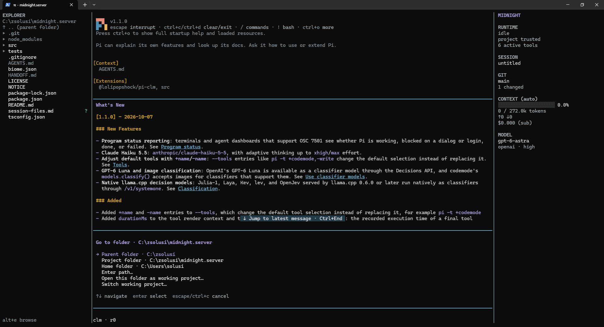

# midnight.server

Midnight's session sidebar and file explorer, extracted from `midnight.server` into a standalone pi extension. Targets **pi 1.0.4**, Node 22.19+, and fullscreen mode. No build step or runtime dependencies beyond pi.



## Install

```powershell
pi install git:github.com/soliluqoy/midnight.server
```

Git access to this repository is required. Restart pi or run `/reload`. Select fullscreen TUI mode in `/settings` if needed.

To try a local checkout for one session:

```powershell
git clone https://github.com/soliluqoy/midnight.server.git
cd midnight.server
pi --extension ./src/index.ts --tui-mode fullscreen
```

For ongoing local development, configure the local checkout as a package **instead of** the Git install, not alongside it. `pi list` should show only one Midnight source. Enabling both creates competing panels/shortcuts; `/reload` reloads both copies rather than updating the Git checkout from your local edits.

## Controls

| Key | Action |
| --- | --- |
| Alt+S | Toggle the right session sidebar |
| Alt+E | Show and focus the left explorer; hide it when already focused |
| Up/Down, PageUp/PageDown | Navigate files |
| Right/Left | Expand/collapse a directory or select its parent |
| Enter | Expand a directory or insert `@path` into the prompt |
| Space | Read-only file preview |
| Alt+G (Explorer focused) | Locations menu: browse folders or explicitly switch the working project |
| Alt+Up (Explorer focused) | Browse the parent folder |
| Alt+Home (Explorer focused) | Back to the session’s project folder |
| Escape | Close preview or return to the prompt |
| Other typing | Return to the prompt and forward the keystroke |

Click to select files, double-click to insert them, or use the mouse wheel to scroll. Click the sidebar model to select a model. Explorer previews include line numbers, syntax highlighting, scrolling, and Enter to insert a reference. Binary files and files larger than 1 MiB display an explanation instead.

**SESSION FILES** shows files touched by successful `edit`/`write` tools on the active conversation branch that still have pending changes in their owning Git repository. Restoring all changes, removing an untracked file, or committing a touched file removes its row and Explorer session dot at the next refresh. Tracked deletions, staged changes, untracked files, and conflicts remain visible. Sibling/nested repositories and linked worktrees are checked independently; the sidebar **GIT** summary remains the working project's summary. Shell-only changes to never-touched paths appear only in Git/Explorer marks. Shell changes to already-touched paths are reconciled normally.

This is a **dirty-file view scoped to session-touched paths**, not an exact session-start diff or line-ownership claim. Pre-existing user changes and subsequent external edits to a touched file can be included. Conversation-tree navigation changes the candidate history, not the disk: each branch is compared against disk state **now**. Saved operations and messages are never rewritten to remove undone edits.

Click a pending entry for its current diff, revalidated before opening. Tracked previews have separate **Staged — HEAD → index** and **Unstaged — index → working tree** sections (an empty tree replaces HEAD before the first commit). Row totals sum both layers; a line can occur in both, even when the working file equals HEAD. Untracked text is compared against empty content using the current file, never an old write snapshot. Conflicts, binary content, mode/type/symlink and submodule changes show explicit status without invented line counts. Pi's diff styling, scrolling, Escape/Space to close, and Enter to insert `@file` are retained. Previews are bounded to 1 MiB and 20,000 source lines; oversized output explains the limit instead of displaying a partial patch as complete. Renames reference the destination and identify both paths in the preview.

**RECORDED FILES** separately labels unverifiable candidates as `history only · status unavailable`. Existing non-Git/ignored files have no reliable persisted baseline and therefore no current +/- totals or pending dots. Clicking them explicitly shows **Recorded operations — not current diff**. Confirmed-absent non-Git/ignored paths disappear; permission/Git failures never count as clean. During refresh, the previous reconciled snapshot remains visible with an updating/stale indication. Existing previews close when refresh invalidates their source; concurrent changes detected while reading produce an unavailable explanation rather than an atomic-snapshot claim. Refresh happens on initialization/resume/reload, agent completion (including bash-only undo), tree navigation, compaction, Explorer focus, and `/midnight refresh`. External changes are not polled.

The sidebar also shows runtime and trust status, active tools, session title, Git branch/status/ahead/behind, context usage, input/output token totals, cost/subscription status, and model/thinking level.

In fullscreen, the session name, Git branch, context, input/output tokens, cost and model/provider/thinking level appear only in the sidebar while it is visible. Cache reads/writes (`R`/`W`) and cache-hit rate (`CH`) stay in the footer and are not duplicated in the sidebar. Closing the sidebar (Alt+S), shrinking the terminal until it hides, or leaving fullscreen restores them in pi's bottom bar. The explorer alone does not hide them. The working-directory path is hidden from the footer only while the visible Explorer shows that same directory. Hiding Explorer or browsing elsewhere restores it; the browse location never replaces a different session working directory. Branch/session labels remain when the sidebar is hidden, and a fully redundant path row is removed. Sidebar context usage and token/cost totals refresh as messages and tool results are saved, rather than waiting for the entire agent run to end. Context percentages use the same one-decimal precision as pi's footer; `(auto)` indicates automatic compaction.

### Token speed

The footer status area shows the latest assistant response's **tokens/sec**, **response duration**, and **TTFT** (time to first token), in both fullscreen and regular TUI mode—even with the sidebar visible. Each model turn resets the measurement; tool execution time is excluded. Timing starts at Pi's `turn_start`, so duration and throughput include context preparation, network latency, and generation. TTFT ends at the first non-empty text/thinking/tool-argument delta or tool-call start, not at a stream header. Providers that do not stream content show `TTFT —`.

While streaming, `~` marks a rough estimate based on emitted characters divided by four (including visible thinking and tool arguments). Updates are throttled to four per second, driven by stream events with no polling timers. On completion, the provider's output-token count replaces the estimate; hidden reasoning may make the final speed differ substantially. Errors/aborts are labeled, and unavailable usage keeps the estimate. The last result stays visible until the next turn; reload, session replacement, or branch navigation clears it. No extra model requests or session entries are created.

### Compact tool output

Tool calls render as one dim summary line instead of pi's shaded box with an output preview, for example `Ran shell command · git status · 2 lines`, `Edited src/index.ts · +12 −3`, or `Searched · /pattern/ in src · 14 matches`. A running call shows its title, elapsed seconds, and the command beneath it. Failed calls show a red `✗` line with the last line of the error. Press Ctrl+O (or click a row) to expand rows into pi's normal renderers. This applies to textual output from every tool, including MCP and other extension tools, in all TUI modes. Inline images remain managed by Pi's image settings.

Expanded codemode results unwrap recognized command-result JSON into readable multiline output, followed by exit code, duration, and any truncation/full-output-file notice. Pi's native block, script highlighting, and nested-call list are retained. Only the display changes: saved/model-facing results, other tools, and unrecognized JSON stay untouched. Formatting runs lazily once per content revision, survives resize/collapse/re-expansion, and has a shared 256 Ki-character parsing budget per result; text beyond that budget remains raw. No parsing runs while collapsed or streaming.

`/midnight compact off` restores pi's default tool rendering and `/midnight compact on` re-enables it; existing rows redraw immediately. The choice lasts for the current extension instance. Pi still separates tool rows with a blank line. To hide thinking blocks as well, press Ctrl+T (pi remembers this setting).

### Automatic session titles

Sidebar titles wrap at word boundaries across up to three lines, with an ellipsis only if more text remains. The sidebar width is unchanged. New automatic titles prefer short, specific 3–5-word task labels; existing titles are not renamed merely to shorten them.

Midnight names unnamed interactive sessions automatically, then checks for title updates after agent rounds, branch navigation, and compaction. Named sessions have a **five-minute cooldown** between background requests, and unchanged conversational text skips the request entirely. There is no delayed background job: the next eligible lifecycle event triggers an update. Unnamed sessions can retry after 30 seconds. It uses a short request to the current model with bounded conversational text (no tool output or images). Titles and the last request time are saved with the title state, so normal reload/resume preserves the cooldown. Titles appear in the sidebar and session selector without toggling Alt+S.

Existing manually named sessions are preserved. `/name Your title` pauses automatic naming; `/midnight title auto` enables it again and explicitly requests an update without waiting for the cooldown; `/midnight title off` disables it. These choices survive reload/resume. Model failures leave the existing title unchanged and retry on a later round. Extra title requests use your provider credentials and may incur charges; their usage is included in Midnight's sidebar totals.

### Browse other locations

Focus Explorer with **Alt+E**, then press **Alt+G** for the **Go to folder** menu: **Parent folder**, **Project folder**, **Home folder**, or **Enter path…**. Destinations are shown beside the first three choices. Use Up/Down and Enter to choose, or Escape to cancel without moving. The menu uses Pi’s built-in selector and reads no directories until a destination is chosen.

A selectable **`.. (parent folder)`** row appears at the top of the tree, except at a drive/filesystem/share root. Enter, Right, Space, or a click on that row opens the parent; it never inserts a file reference. The first file is selected by default; press Up to reach the parent row. Outside the project the title shows `[external]` and long paths keep the trailing segment visible. Ordinary folder expansion and file previews are unchanged. **Alt+Up** and **Alt+Home** remain quick shortcuts for parent and project.

Choose **Enter path…** for a folder such as `D:\Projects`, `C:\Users\solusi\Downloads`, or `~/Downloads`. Quoted paths and spaces are supported; relative paths resolve from the folder currently shown in Explorer. The current location appears once below the plain Explorer title, without repeating the folder name in the heading. Unfocused Explorer shows only the browse shortcut; focused hints show file actions, locations, and Escape. The return-to-project hint appears only when browsing away from the project root. All navigation shortcuts remain available while focused. These navigation keys only apply while Explorer is focused; ordinary typing still returns to the prompt.

The four browsing actions never change the agent’s working directory, session, or sidebar Git repository. The separate **Open this folder as working project…** and **Switch working project…** actions do, after confirmation (see below). Space previews files locally; Enter inserts a project-relative `@file` inside the project or an absolute reference outside it, quoting as needed. Browsing and previewing make no model requests. Other drives and accessible network shares can be opened by path; OS permissions still apply. Invalid or unreadable destinations leave the current tree intact. Navigation resets expansion and selection, and reload/session replacement returns to the project.

The explorer includes hidden and ignored files, `node_modules`, and `.git`. Ignored project paths are dimmed. Directories load only when expanded. Project Git marks and session-change dots are mapped to the browsing location; unrelated repositories are not scanned or decorated with project Git marks. The sidebar always shows the session’s project Git status.

### Switch the working project

Press **Alt+E → Alt+G → Open this folder as working project…** to make the currently browsed folder the agent’s working directory. Or choose **Switch working project…** and enter a path; relative paths in this menu resolve from the Explorer location. Any accessible folder is supported; it need not be a Git repository.

From the prompt, use **`/midnight project C:\Projects\other-repo`**, or **`/midnight project`** to ask for a path. Command-relative paths resolve from the current working project. Quotes, spaces, `~`, other drives, and UNC paths are supported. Aliases are resolved to their canonical directory; selecting the current project is a no-op.

A confirmation shows the old/new paths and explains the fresh-session boundary. Switching is refused while the agent is active, compacting, or has queued messages; finish/stop the work and clear the queue first. The unsent text draft moves unchanged into the new session for review, not automatic submission—check any relative file references. Previous conversation history and instructions are **not** copied or summarized. Return to the old saved conversation using `/resume` (show all projects in the picker).

Midnight uses Pi 1.0.4’s public `SessionManager` and `ctx.switchSession()` APIs, not `process.chdir()`, a subprocess, or private-field patches. It writes one header-only destination session and lets Pi perform its normal `/resume` teardown/rebuild, including cwd-bound tools, project instructions, settings, extensions, trust handling, and the UI. Midnight cancels its old work and rebuilds Explorer/sidebar Git state from the new context. Other extensions must likewise use Pi’s context cwd rather than assume the process startup directory changes. Install Midnight as a user-level package to keep these controls available across projects.

Default session storage follows the destination project; an existing custom session directory is retained. Switching requires persistent sessions (`--no-session` is not supported). Each successful switch creates a fresh saved session, without scanning or selecting old sessions. Cancelled/abandoned attempts remove their unused header-only file; a file modified by a hook is retained. Validation failures leave the current session intact. As with Pi’s `/resume`, a fatal error while initializing destination resources can require restarting Pi and resuming the old saved session; the extension does not attempt an unsafe partial rollback.

**Performance:** no new polling, watchers, background discovery, render-path I/O, history copying, or model calls. Path validation and session creation run only on explicit activation. The locations menu does no filesystem work until an action is chosen; switching does not first browse/scan the destination. Pi’s native resource reload and Midnight’s normal initial shared Git refresh still have a one-time switching cost. There is no additional steady-state refresh work.

## Configuration

Both panels start in `auto` mode: the sidebar appears at 110 columns; the explorer at 150. The panels reserve 36 and 32 columns respectively. Explicitly opened panels still hide when too little room remains for the prompt.

```text
/midnight sidebar auto
/midnight sidebar always
/midnight sidebar hidden
/midnight explorer auto
/midnight explorer always
/midnight explorer hidden
/midnight explorer go D:\Projects
/midnight explorer go
/midnight explorer parent
/midnight explorer project
/midnight project C:\Projects\other-repo
/midnight project
/midnight compact on
/midnight compact off
/midnight title auto
/midnight title off
/midnight refresh
```

Without a mode, `/midnight sidebar` and `/midnight explorer` perform their shortcut actions. `/midnight explorer go` opens the locations menu; supplying a path skips the menu and navigates directly. Modes last for the current extension instance and reset on reload/session replacement. Refresh runs automatically after agent completion, branch navigation, compaction, and explorer focus. Use `/midnight refresh` for external filesystem changes.

Customize keys in `~/.pi/agent/keybindings.json`, then `/reload`:

```json
{
  "app.sidebar.toggle": "alt+s",
  "app.explorer.toggle": "alt+e",
  "app.explorer.expand": "right",
  "app.explorer.collapse": "left",
  "app.explorer.preview": "space",
  "app.explorer.folder": "alt+g",
  "app.explorer.parent": "alt+up",
  "app.explorer.project": "alt+home"
}
```

Generic navigation uses pi's `tui.select.*` bindings. An empty array disables a binding. Shortcut handling leaves overlays in control while they are open.

## Performance and integration

Filesystem reads and Git commands run asynchronously, outside rendering. One shared, NUL-delimited project Git status scan supplies the branch, summary, file marks, ignored paths, and session-file reconciliation. Repository identity is revalidated at refresh, with bounded HEAD/index metadata probes around status and deltas; creating a nested repository cannot leave a stale workspace prefix. Only repositories owning active session candidates receive additional status scans, grouped per repository. Ownership lookups coalesce by parent within each refresh. Numstat reads batch candidate paths by repository/layer with bounded argument lengths; detailed patches are fetched only on click. At most four candidate filesystem reads run concurrently, and refresh invalidates content even when status codes remain unchanged. Untracked files are counted individually, including files inside new directories. Directory reads coalesce, use a shared natural-sort collator, and run at most eight at a time. Refresh batches explorer updates and reloads only visible, expanded directories; collapsed directories refresh when reopened. Hidden explorers do not trigger directory reads. Previous listings remain visible until replacement data arrives. Folder navigation reads only the destination directory and reuses it immediately. Only the project cache and the current browsing cache are retained; replaced/pending locations are disposed and late results discarded. External browsing adds no Git scans, polling, watchers, model calls, or dependencies.

Session totals and file changes update incrementally on append; branch/session replacement safely rebuilds them. Saved revisions detected while drawing are analyzed in a coalesced microtask rather than inside rendering. Unchanged sidebar, explorer, preview, and compact-tool rows reuse cached lines. Completed tool summaries are computed once per result revision, and preview resizing does not repeat syntax highlighting. A single elapsed-time clock runs only while compact tool calls are executing, and is cleared on session replacement/reload/shutdown. There are no filesystem polling timers or recursive watchers.

The extension preserves pi's existing transcript, scroll view, editor, header, footer, and widgets. It wraps the fullscreen layout in an `HStack`. Pi 1.0.4 exposes a layout setter but no getter, so `src/layout.ts` contains guarded reads of its internal `layoutRoot` and built-in footer data. The footer keeps its cache stats and extension statuses; its session name, branch, input/output tokens, cost, context and model/provider/thinking level are filtered while the sidebar is visible. A read-only footer view omits the session name before path formatting/truncation without changing shared session data. `src/footer-usage.ts` uses ANSI-aware slicing before narrow-width truncation to preserve cache stats and remove the other usage fields. Independent Explorer visibility/path checks suppress only the matching working-directory path, preserving any branch/session suffix before truncation. Custom extension footers are left untouched. `src/session-analysis.ts` also guards access to Pi's O(1) entry-count method, which exists at runtime but is omitted from its read-only type; without it, analysis falls back to full snapshots. This is why compatibility is pinned to 1.0.4. Unknown layouts are left untouched. Other extensions that replace the entire fullscreen layout may conflict.

Reload/shutdown restores the original layout, returns focus, closes previews, cancels Git processes, and discards late filesystem results. RPC, JSON, and print modes do not initialize panels. Midnight-specific server services are not required; runtime and trust values come from pi's extension context.

## Development

From the repository root:

```powershell
npm ci --ignore-scripts
npm run check
npm test
```

`npm run check` runs Biome (warnings are errors) and TypeScript validation, including test sources. `npm test` uses Node's built-in test runner and native TypeScript stripping; it runs injected-I/O/component tests and real Git scenarios in disposable temporary repositories, without providers. It requires Git on PATH. Fullscreen interaction still needs manual verification with only the local extension loaded.

See `NOTICE` for extraction provenance and `LICENSE` for the inherited MIT license.
